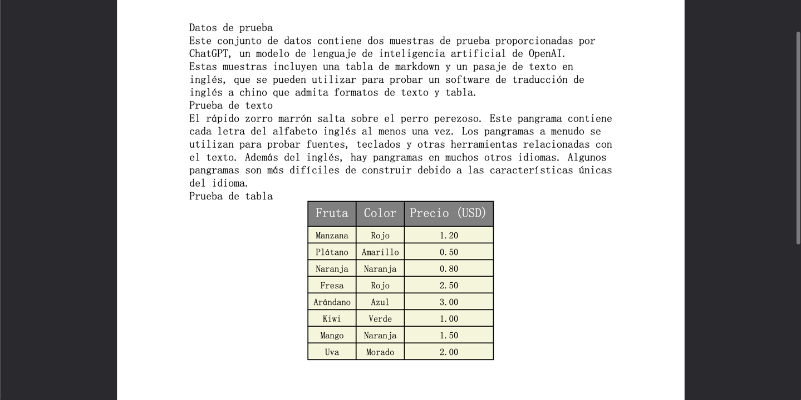

# AI翻译助手

## 特色

- 多语言支持: 各种语言之间互相翻译
- 多风格选择：可以翻译为各种不同的风格
- 即时翻译：在页面上输入文本后即刻翻译
- 文档翻译：上传文档后对文档整体进行翻译，目前支持：.txt, .pdf

## 功能预览

### 支持即时翻译和文档翻译


### 选择你的翻译风格!
选择不同的风格可以得到不同风格的译文，例如：

原文: The intricate dance of the stars shimmered against the backdrop of the velvety night sky, casting a spell of wonder and awe upon the beholder.

优雅文豪: 星星的错综舞蹈，在天幕的背景下闪烁，向观赏者施加着惊奇和敬畏的魔力。

普通: 星星的复杂舞蹈在天鹅绒般的夜空背景下闪烁，给观者带来了惊叹和敬畏的魔力。

轻松浪漫: 星星们纷繁复杂的舞蹈在天幕之下闪烁不已，给观赏者带来一种奇异而敬畏的魔力。

### 即时翻译


### 文档翻译


#### 翻译前


#### 翻译后



## 快速开始

下载源码:

```
git clone https://github.com/Blackoutta/ai-translator.git
```

进入源码根目录:

```
cd ai-translator
```

安装依赖

```
pip install -r requirements.txt
```

设置API KEY和BASE URL

```
export OPENAI_API_KEY=your_api_key
export OPENAI_BASE_URL=your_base_url
```

用python运行应用:

```
python ./src/app.py
```

使用浏览器访问以下url

```
http://127.0.0.1:5000/
```

## TODO

- PDF布局及样式还原
- 优化前端用户体验
- 优化翻译准确度


